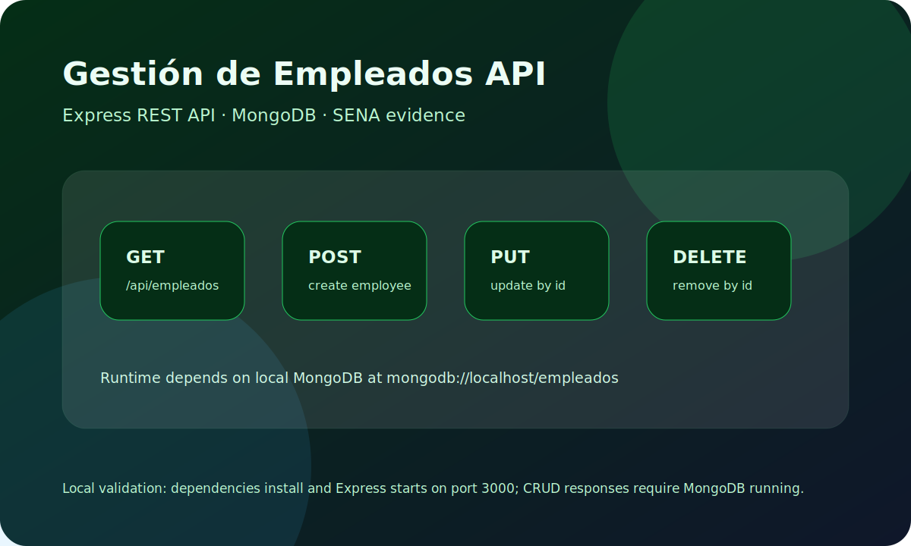

# Gestión de Empleados - Backend Express

API REST con **Express**, **MongoDB** y **Mongoose** para una evidencia SENA de gestión de empleados.

<p align="center">
  
</p>

## Resumen

Este backend expone endpoints CRUD para empleados. Está pensado para trabajar con el frontend Angular que consume `http://localhost:3000/api/empleados`.

## Stack

- Node.js
- Express
- MongoDB
- Mongoose
- CORS
- Morgan
- dotenv
- Nodemon

## Modelo de Empleado

```js
{
  name: String,
  position: String,
  office: String,
  salary: Number
}
```

## Endpoints

```text
GET    /api/empleados       # listar empleados
POST   /api/empleados       # crear empleado
GET    /api/empleados/:id   # obtener empleado por id
PUT    /api/empleados/:id   # actualizar empleado
DELETE /api/empleados/:id   # eliminar empleado
```

## Requisitos

- Node.js
- MongoDB local activo
- Base de datos esperada: `mongodb://localhost/empleados`

## Instalación

```bash
npm install
npm run dev
```

El servidor escucha en `http://localhost:3000`.

## Validación Local

Validación realizada durante esta actualización:

```bash
npm install --package-lock=false
node index.js
```

Resultado:

- Las dependencias se instalaron correctamente.
- Express inicia y muestra `server activo en el puerto 3000`.
- Las respuestas CRUD requieren MongoDB activo en `mongodb://localhost/empleados`; sin MongoDB local, las consultas quedan esperando la conexión.

## Estructura

```text
index.js                         # Entrada Express y CORS
routes/empleado.routes.js        # Rutas REST
controllers/empleado.controller.js # Controladores CRUD
models/empleado.js               # Modelo Mongoose
database.js                      # Conexión MongoDB
```

## Nota de Repositorio

Este repositorio tiene `node_modules/` versionado desde antes. Para una limpieza futura conviene sacarlo del historial y dejarlo ignorado con `.gitignore`, pero en esta actualización solo se documentó el estado actual y se agregó imagen al README.

**BY BLAPER**
